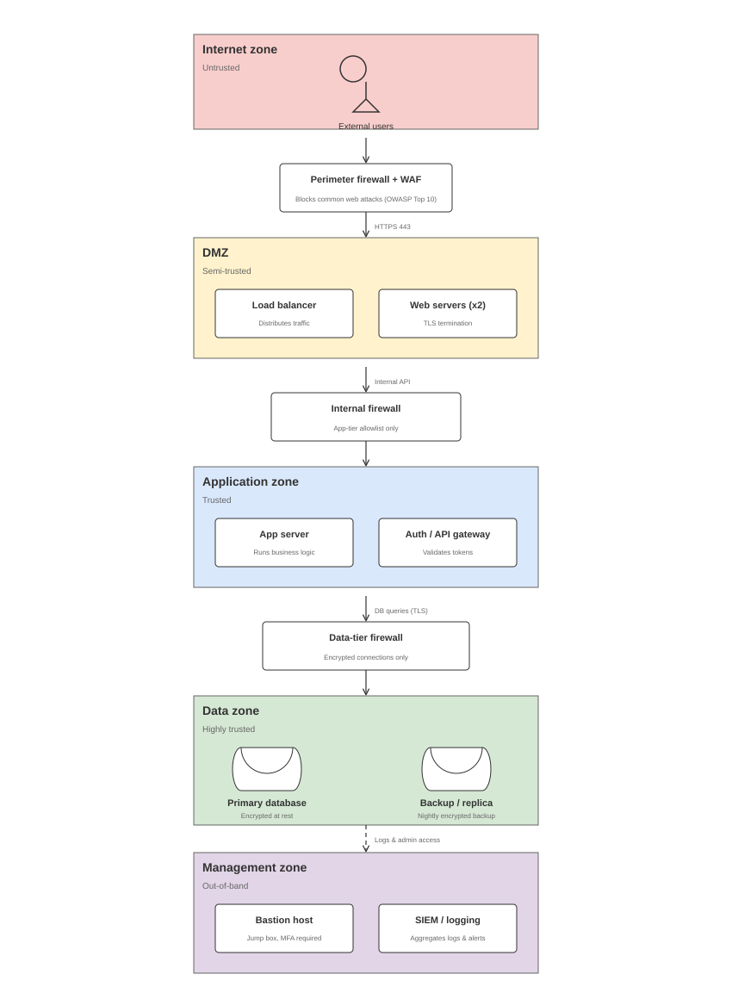

# Cybersecurity Architecture Lab — Security Architecture Diagram

This lab covers the fundamentals of security architecture diagramming: security
zones, trust boundaries, and control placement for a simple e-commerce web
application.

## Scenario

A public-facing e-commerce application with:
- A website where customers browse and shop
- An administrative portal for staff to manage products and orders
- A database storing customer information and orders

## Diagram

[View live diagram (read-only)](https://viewer.diagrams.net/?url=https://raw.githubusercontent.com/CyberRay007/my-portfolio/main/cybersecurity-architecture-lab/intermediate_security_architecture.drawio)

The diagram segments the application into five trust zones, each separated by
a dedicated control:

| Zone | Trust level | Contains |
|---|---|---|
| Internet zone | Untrusted | External users |
| — | — | Perimeter firewall + WAF (blocks common web attacks) |
| DMZ | Semi-trusted | Load balancer, web servers (TLS termination) |
| — | — | Internal firewall (app-tier allowlist only) |
| Application zone | Trusted | App server, auth / API gateway |
| — | — | Data-tier firewall (encrypted connections only) |
| Data zone | Highly trusted | Primary database, backup / replica (encrypted at rest) |
| Management zone | Out-of-band | Bastion host (MFA), SIEM / logging |

**Design principles applied:**
- Every hop between zones crosses a security control — no direct access
  across a trust boundary
- Sensitive data (the database) sits furthest from the untrusted zone
- Administrative access is routed through a bastion host rather than directly
  into the application tier
- Centralized logging (SIEM) aggregates events from all zones for monitoring

## Source file

The editable `.drawio` source lives in this folder alongside the rendered
image. The "View live diagram" link above opens it through draw.io's
read-only viewer, so anyone can explore the full diagram without being able
to edit or save changes — only someone with push access to this repo can
change the source.
