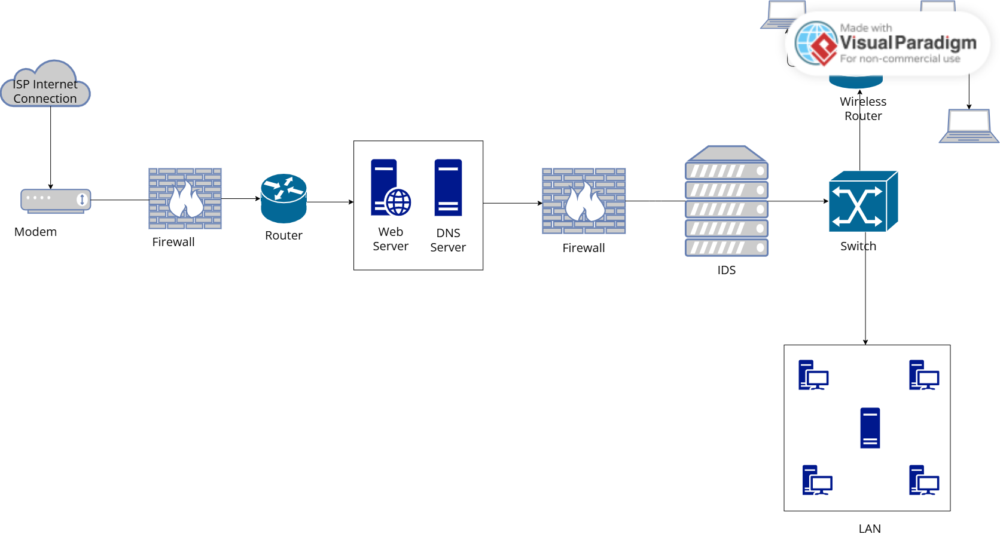

# Network Security Architecture — Perimeter Defense Design

**Course:** [Cybersecurity Architecture](https://www.coursera.org/learn/cybersecurity-architecture/home/welcome) (IBM, Coursera)
**Tool used:** Visual Paradigm Online
**Type:** Hands-on lab / conceptual network diagram

## Overview

This lab is a hands-on network architecture exercise from IBM's Cybersecurity Architecture course on Coursera. The task was to design a small organization's network so that it enforces defense-in-depth: multiple independent security layers between the public internet and the internal LAN, rather than relying on a single perimeter control.

## Architecture Diagram

## Design Breakdown

**Perimeter ingress**
- **ISP Internet Connection → Modem → Firewall #1 → Router** — traffic entering the network passes through a firewall immediately after the modem, before it ever reaches routing logic. This is the first layer of defense-in-depth: nothing gets routed anywhere internal without being filtered first.

**DMZ (demilitarized zone)**
- **Web Server / DNS Server** sit in their own segment behind the router, boxed off from both the internet and the internal network. These are the only two services the outside world needs to reach, so isolating them here means a compromise of either box doesn't hand an attacker a direct path to internal systems.

**Internal perimeter**
- **Firewall #2 → IDS (Intrusion Detection System)** — a second, independent firewall sits between the DMZ and the internal network, so a breach of the DMZ doesn't automatically breach the LAN. The IDS immediately behind it inspects traffic crossing that boundary and flags anomalous activity, giving visibility into attacks that get past the firewall rule set.

**Core distribution**
- **Switch** — the core switching point that fans out to the two internal segments: the wireless network and the wired LAN.

**Access layer**
- **Wireless Router → laptops** — wireless clients sit on their own branch off the switch, separated from the wired LAN.
- **LAN** — the wired segment houses workstations and an internal server, reachable only after traffic has passed both firewalls and the IDS.

## Security Principles Demonstrated

- **Defense in depth** — two firewalls and an IDS stand between the internet and the LAN, not one.
- **Network segmentation** — DMZ, wireless, and wired LAN are all isolated from each other, limiting lateral movement if any single segment is compromised.
- **Least exposure** — only the Web and DNS servers are internet-facing; everything else sits behind at least one additional firewall.
- **Monitoring at trust boundaries** — the IDS is placed exactly at the internal/external trust boundary, not buried deep inside the LAN where it would catch threats too late.

## Notes

This diagram documents the conceptual design produced during the lab; it is not a live or production environment. Shared here as part of ongoing cybersecurity coursework and portfolio documentation.
